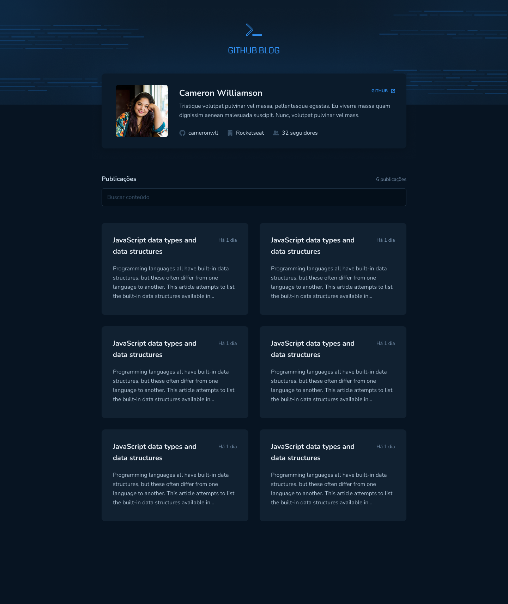
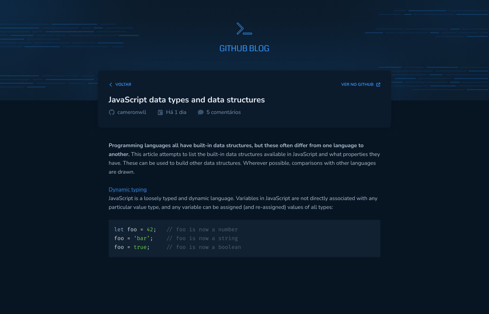

<h1 align="center">
    
</h1>

<h4 align="center"> 
     Aplicação Concluída!! 	
</h4>

 <a href="#-sobre-o-projeto">Sobre</a> •
 <a href="#-funcionalidades">Funcionalidades</a> •
 <a href="#-layout">Layout</a> • 
 <a href="#-como-executar-o-projeto">Como executar o site</a> • 
 <a href="#-tecnologias">Tecnologias</a> • 
 <a href="#-autor">Autor</a> • 
 <a href="#user-content--licença">Licença</a>

## 💻 Sobre o projeto

Este projeto consiste em um blog desenvolvido em forma de desafio durante a especialização
da Rocketseat o github-blog, nele foi usado a tecnoligia Reactjs no front-end junto ao typescript com vite
Usei styledComponents na estilização.
Usa hooks do tipo useState useEffect.
Criação de componentes que conversam
entre si, usando props
além de context api,react-hook-form,axios nas requisições a api do github
além de libs para estilização dos códigos direto no react...

---

- [x] links com foto para o github
- [x] consumo a api do github
- [x] rotas para os posts do blog
- [x] ultilização de envs

### Web

  

  

---

---

## 🚀 Como ver o projeto/site

basta acessar o o link
[github-blog](https://www.linkedin.com/in/deyvison-tavares/recent-activity/)

---

## 🛠 Tecnologias

As seguintes ferramentas foram usadas na construção do projeto:

#### **Website**/ ([axios](https://axios-http.com/) + [Syled-components](https://styled-components.com/) + [dateFns](https://date-fns.org/) + [zod](https://zod.dev/) + [hoockForm](https://react-hook-form.com/api/useform/) + [Ts](https://www.typescriptlang.org/docs/) + [ReactJs](https://pt-br.reactjs.org/docs/cdn-links.html))

---

## 🦸 Autor

 
<a href="https://github.com/DeyvisonTav">
 
  
  
 <b>Deyvison Tavares</b>🚀</a>
  
  

---

## 📝 Licença

Este projeto esta sobe a licença [MIT](./LICENSE).

Feito com ❤️ por Deyvison Tavares 👋🏽 [Entre em contato!](https://www.linkedin.com/in/deyvison-tavares/)
